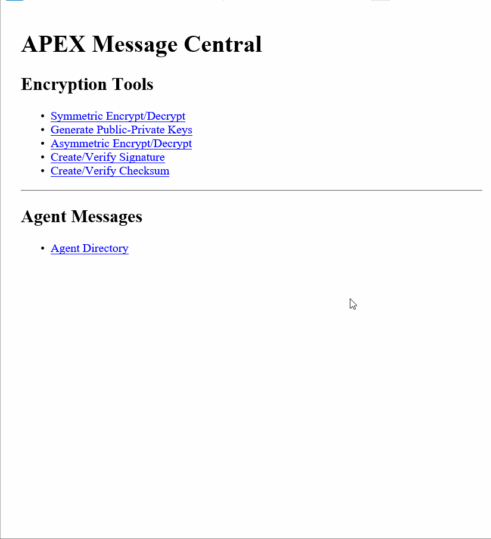

# Project 5 - Encryption

Time spent: **10** hours spent in total

## User Stories

The following **required** functionality is completed:

1. Symmetric Encrypt/Decrypt
  * [x]  Required: Repair the symmetric encrypt and decrypt code

2. Encrypted Message 1
  * [x]  Required: Decrypt the government message
  * [x]  Required: Encrypt a response and include in this README
  * [x]  My response: wn5oV6KQfwP0V0m0KFIOdwr3UiE4p9y8uXEuRpF0wlJlh9SVn9Qror0NIZAl678Q 

3. Generate Public-Private Keys
  * [x]  Required: Repair the key generator code
  * [x]  Required: Generate keys for "johnsteed" and add him to the Agent Directory

4. Asymmetric Encrypt/Decrypt
  * [x]  Required: Repair the asymmetric encrypt and decrypt code

5. Create/Verify Signature
  * [x]  Required: Repair the create and verify signature code
  
6. Encrypted Message 2
  * [x]  Required: Decrypt the message
  * [x]  Required: Verify the message
  * [x]  Required: Include a response message in this README
  * [x]  My response:  --- Begining of codename --- ztQNbfL1dDzvc/TB4OhGAl5E/HYjpQE9Jib6UcSoQIph9V0cKBFavBb/5oIXCoB9U8wksfFnmKRZgkaUfAigcN75by9V+97OwWFgB2854XDwdjt7F7SvtyBsiSOfqLvQ+xLpby6MAkz3VTn1sMIAIQWQHgeOu/nQ2fz2XGif14rnAQmSWRSCIfetvu8VlBM+XVSHdJMhozV/217bccNeKSNtGvyN6G1mi3F7vrNiJFHey1tynjx7XrE0LFYcdg5QIYF2PdY0yyJOWi9RaQELHl0pxx8jG63ObNl3Sj2k/b1lVEgE4UfX+12F2aZx1B36pB8Hw+bpHxZX4sQbZiv9zQ== ---End of codename---

---Beginning of signature --- idgZn5gCz11BE+9ExJpFaSSdFxHGBir8/yuQFUCkHFRlmCXi5DkhNZ0R0q3e6CbmREsVsNE65VlEwMcFbZqC2zf3KdlFS0iVaXC9NtNOGz2SmQvuzT8oPxkLbUc5FjIWOv/Cm0gkFSvJ8FZqi/RjG6py9wZSBtn+UYx1xhL7IHcFUPCq3/7lla0WvI4jj1rKTel0lJ3J9qWeqtwRqoSMJOT5JvokxqdBzXiEkxD6+dGMD1/bkXoshmBFqS+PQ8xOFtoL60MJebCNGFuVrhVgPUyCw4AyH0QnzgdGzmHPjmfiHcVcVmJ3JZYpN8Dq5l6HCrPBLONlHzagkHPOYSu6fA== --- End of signature---
  
7. Agent Messages
  * [x]  Required: Repair the dropbox code
  * [x]  Required: Repair the messages area
  * [x]  Required: Display encrypted messages for all agents
  * [x]  Required: Messages indicate whether the message signature is valid
  * [x]  Required: Your messages are automatically decrypted

8. Identify the Double Agent
  * [x]  Required: Decrypt as many email messages as possible
  * [x]  Required: Identify the double agent:  __natasha

The following objectives are **optional**:

* Bonus Objective 1.
  * [x]  Track down the bugs in the code and fix them.

* Bonus Objective 2.
  * [x]  Write a report of your discoveries (longer than 300 characters).
  * [x]  Compose a secure email for sending over an insecure network.
  * [x]  Include the email with your encrypted report in this README.
  * [x]  Email: 
  ---Beginning of the report --- kgM1rrTtIVN15pdJIfmGWPOnhKmkshv+blJEGRF9WJ8R7cE66P23znO0CeT2XzSTNHGT3vgmi5lzYwWmtg8t1fIJh/bOh3rYQIYDJU8DR7WQNReS7LEEi0fP1IqkeVzDuEeA9NfAbPMRXBdxN1UVTUfxJJv9Ix96oh13WDWz+y48it1hD4tRMFYe9d1A3FHFgTqBOAEkS/0b1FKwXP8Flsx/6Y3cx3nPtN8gcTW+5EianRfkZ+y+PENn2KexTKYNR7yowp84E7Ze7fazvt6GFkFe94kKFH4mFUIUoVlvgO8EK2mHoR/jqlNh95I7p6NEwQHeogvM9PvIg9rRzIdZEkErAatBSvzIMIKDa5nrYs8twle2Eh5nQNX3Om8LAOcZVOtrnBHYui3UNP6L4vtGEet6LQMJTVMYOrZtAt19b0Nc6GO6pomttEQ7pTaZxNej0SHyYbNPHWj36KarqBwY2q4Q0D1/uPA8LKyhgAlvNLK4UEEjnNudtpX4j5WxcThVeT54WAS7LZd96AO7oaBROQVq4ooTt0k+YvHcDBootzWCCTkdfdPwqkTuw/JolgvtxvCHrCEUbVv0cRwG60cJnw== ---End of the report---

---Beginning of encrypted symmetric key --- s/Xqo2HnWj4MojU1Q8c/urKBtowOtcbAvy97PXPrXT67Dw7+i0QDl2ddKQUxkecnGCA7yH5k3qqMzb6qgxZwpis/eR6Z2Wz3DuBhX59lGkOrCWb1s64tE/LZydcl9MpiKKa9gexdtD7LCSwxAgixh1wrvrCEF12r8Yt22KpMbNh1qwCNI7JwvCq+3NPk+0eKXaoO/VHJonSMMpOpdP6nrKDt6NfzQ2YxZds4RYV3yo2HRMTjFgtlorJzTbnfgr9oDea271DPtg7Z83ExycqJTdGxgym8RylEt6YC1WxGZxdIELgx+6pGXj1qVhJXXLwMZeiTzDi04ACphuV100PSJA== ---End of encrypted symmetric key

---Beginning of signature --- nvSai1lY5IujTHcrb7W1lPSSR81vWnWSJZGO0pHjEk5VkEbL4yeeeNHp4X5On4rCHd/QHb9BKY0czAo6zq8WghERWiMBuS2obv2THsKylO8EfyZwC7LihiwjOGUCL0/B2yTdky1YVSmLBRk9p8OyDv3TacCJxJPqGZZtDZPLI85XjKdc14QFpEXhIZm1S2qLUVmI6msVtFb9f3YCwIyutfH1PNxnLqsy8bnDOjU6BBsuwQP5L2ByRXLboioZbIa9pCaWZl9J6zLAbmCo/3qKlL6j8FAJHfkD6WeDUcKqKpFWnpNJ0NplhIId0dQx6dLZu1NrbPDBY3wyHxLG5LeX0Q== --- End of signature---

* Bonus Objective 3.
  * [x]  Add a "Create/Verify Checksum" section to the Encryption Tools area.

* Advanced Objective 1.
  * [ ]  Add support for other symmetric algorithms.

## Video Walkthrough

Here's a walkthrough of implemented user stories:

GIF created with [LiceCap](http://www.cockos.com/licecap/).

## Notes

Getting used to how encryption works and how you can use it was interesting. 

## License

    Copyright [2017] [Gregory Szymanski]

    Licensed under the Apache License, Version 2.0 (the "License");
    you may not use this file except in compliance with the License.
    You may obtain a copy of the License at

        http://www.apache.org/licenses/LICENSE-2.0

    Unless required by applicable law or agreed to in writing, software
    distributed under the License is distributed on an "AS IS" BASIS,
    WITHOUT WARRANTIES OR CONDITIONS OF ANY KIND, either express or implied.
    See the License for the specific language governing permissions and
    limitations under the License.
